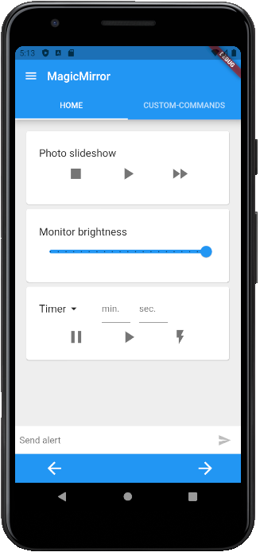

# MM-Remote 
[](https://GitHub.com/Klettner/MM-Remote/releases/)
[](https://GitHub.com/Klettner/MM-Remote/releases/)
[](https://github.com/Klettner/MM-Remote/blob/master/LICENSE)

  
MM-Remote is an Android app to control your [**MagicMirror**](https://magicmirror.builders/) remotely via a smartphone :iphone:.  
  

  
## Features ##
  * Change the monitor brightness :high_brightness:    
  * Send alerts to the mirror  
  * Shutdown and reboot the mirror  
  * Turn the monitor on and off  
  * Play, stop and skip images :camera: of a photo-slideshow
  * Switch between UI-pages  
  * Create your own custom commands  
    
### v1.0.3 ###
  * Start a timer on the mirror
  * Start a stop-watch :hourglass_flowing_sand: on the mirror
  * Hide and reorder default commands on the Home-tab  

### v2.0.0 ###
  * Changed to new API of MMM-Remote-Control for the communication with the mirror, as the previously used one will be deprecated soon
  * Increased security through the usage of apiKeys
  * Removed port setting, because it was redundant (should always be port 8080)
  
&nbsp;
## Dependencies ##
  
### Required :warning: (the app won't work without it): ###
| Module | Usage |
| ------ |------ |
| [MMM-Remote-Control](https://github.com/Jopyth/MMM-Remote-Control) (version 2.2.0 or higher)| Communication between app and mirror |
    
### Optional (without these, some default commands won't work): ###
If you do not use all the optional dependencies some default commands won't work, but such commands can be hidden in the settings.  

| Module | Usage |  
| ------ |------ |  
| [MMM-BackgroundSlideshow](https://github.com/darickc/MMM-BackgroundSlideshow) | Controlling a photo-slideshow on the mirror |  
| [MMM-Pages](https://github.com/edward-shen/MMM-pages) | Switching between different UI-pages |  
| [MMM-StopwatchTimer](https://github.com/klettner/MMM-StopwatchTimer) | Controlling a timer/stop-watch on the mirror |  
  
&nbsp;
## Set-up ##
### Option 1 (easy) ###
Click [here](https://github.com/Klettner/MM-Remote/releases) and choose the latest release. Pick the **app-release.apk** file and download [:arrow_down:](https://github.com/Klettner/MM-Remote/releases) it. This file should be compatible with every android phone. Once the file is downloaded to your phone, click it to install the app. A warning will popup as this app was not downloaded from the app store. If you ignore this warning, the app will install, and you're done. 
Once the app is installed you can delete the .apk file, it is not needed anymore.  

### Option 2 (compile the app by yourself) ###
First you need to clone this repository with Git. The app is written in **Dart** with the help of googles **Flutter** framework. To compile the app you need to set up Flutter if you haven't done so already. If you have never used Flutter before, there is a good [installation guide and documentation](https://flutter.dev/docs/get-started/install) available. After Flutter is set up, run ```flutter build apk``` or ```flutter build apk --split-per-abi``` in your terminal to create the apk files.

## Getting started ##
After starting the MM-Remote app, tab on the :heavy_plus_sign: on the bottom-right to add you MagicMirror. 
  - Give your mirror a name
  - Add it's IP-address to the next field (e.g. something like 192.168.0.0). You can get the IP-address by typing `hostname -I` in the console of the raspberry pi 
  - The last field requires the apiKey you have specified for the MMM-Remote-Control module in the config.js of your mirror (make sure it is correct, otherwise the app will not be able to communicate with the mirror)

**How to get your apiKey:**  
Open the config.js file and search for MMM-Remote-Control. It should look something like this:  
```
{
    module: 'MMM-Remote-Control'
    config: {
        apiKey: 'bc2e979db92f4741afad01d5d18eb8e2'
    }
},
```
If you can't find the attribute 'apiKey', add it to your config. You can choose the value of this attribute by yourself.
Don't make it to simple, think about it as a password for your mirror. This is the value you need to add in the apiKey 
field when creating a device in the MM-Remote app. You can find more information about the apiKey [here](https://github.com/Jopyth/MMM-Remote-Control/blob/master/API/README.md).

Now you should be able to remote control your mirror. If you want to reorder or hide some default commands displayed in
the **HOME** tab, go to settings and check :white_check_mark: the default command boxes in the order in which these commands 
should be displayed. Keep in mind, if you don't use all the modules mentioned under dependencies, some buttons might not
work (e.g. changing the displayed UI-pages of your mirror via the left and right arrows on the bottom only works if you 
are using the MMM-Pages module). You can always create you own commands in the **CUSTOM-COMMANDS** tab to extend the 
functionalities of the app. If there are any MagicMirror modules for which it is impractical to create your own **CUSTOM-COMMANDS** (e.g. because you need text input fields, a slider or many buttons) let me know, I might consider creating :wrench: a default command for it in future releases.  
   
&nbsp;
## :bulb: Trouble shooting :bulb: ##  
  - If you have performed the above steps, but the mirror still does not respond, have a look at you *config.js* file. Usually at the beginning of the file there is  something called the `ipWhitelist:`. Add the IP-address of your smartphone here to allow it sending commands to your mirror. If you don't know how to find out the IP-address of your smartphone a quick search with your favorite search engine will help.  
  - Check if you are using a recent version (2.2.0 or higher) of [MMM-Remote-Control](https://github.com/Jopyth/MMM-Remote-Control)
  - Check if you have put in the apiKey which is specified in your config.js. To do this, open the settings of MM-Remote. Here you can see the currently active apiKey and can change it (e.g. if there is a typo present).
  - If a command is not working even though you are using all the required dependencies (e.g. toggling the monitor on/off might not work if you are using a TV instead of a pc-monitor) you can overwrite the shell-command which is used with a command that is working for you. To do this, open your **config.js** file and add the **customCommand** section to the module [MMM-Remote-Control](https://github.com/Jopyth/MMM-Remote-Control).  
  ```
  module: 'MMM-Remote-Control',
    config: {
      customCommand: {
        monitorOnCommand: 'Shell command that is working for you, to turn your monitor on',
        monitorOff: 'Shell command that is working for you, to turn your monitor off',
      },
    },  
  ```

&nbsp;
## Final words :tada: ##
This is the first app I have created, therefore I would be happy about some feedback.  
If you have any feature requests, bugs or ideas for improvements please create an issue. 
If you want to contribute yourself, feel free to make a pull request.
