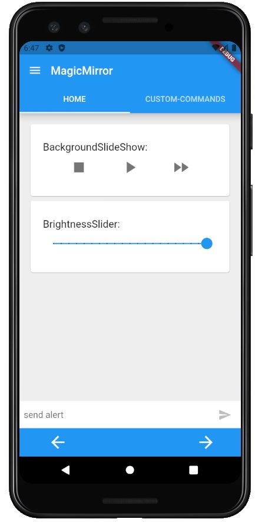

## MM-Remote 
[](https://GitHub.com/Klettner/MM-Remote/releases/)
[](https://GitHub.com/Klettner/MM-Remote/releases/)
[](https://github.com/Klettner/MM-Remote/blob/master/LICENSE)

  
MM-Remote is an Android app to control your **MagicMirror** via smartphone :iphone:.  
  

  
## Features ##
  * Change the monitor brightness :high_brightness:    
  * Send alerts to the mirror  
  * Shutdown and reboot the mirror  
  * Turn monitor on and off  
  * Play, stop and skip images :camera: of a photo-slideshow
  * Switch between UI-pages  
  * Create your own custom commands  
    
### v1.0.3 ###
  * Start a timer on the mirror
  * Start a stop-watch :alarm_clock: on the mirror
  * Hide and reorder default commands on the Home-tab
  
## Dependencies ##
  
### Required :warning: (the app won't work without it): ###
  * [MMM-Remote-Control](https://github.com/Jopyth/MMM-Remote-Control) (used for communication with the mirror)
    
### Optional (without these, some default commands won't work): ###
  * [MMM-BackgroundSlideshow](https://github.com/darickc/MMM-BackgroundSlideshow) (controlling a photo-slideshow on the mirror)
  * [MMM-Pages](https://github.com/edward-shen/MMM-pages) (switching between different UI-pages)
  * [MMM-StopwatchTimer](https://github.com/klettner/MMM-StopwatchTimer) (controlling a timer/stop-watch on the mirror)
  
Without all the optional dependencies some of the default commands won't work, but such commands can be hidden in the settings.  
  
&nbsp;
## Set-up ##
### Option 1 (easiest) ###
Click [here](https://github.com/Klettner/MM-Remote/releases) and choose the latest release. There are four different .apk files available (the file which will install the app on your phone :iphone:). Pick the **---.apk** file which should be compatible with every android phone (but takes a little bit more storage than set-up option 2) and download :arrow_down: it. Once the file is downloaded to your phone, click it to install the app. A warning will popup as this app was not downloaded from the app store. If you ignore this warning, the app will install and your done. 
Once the app is installed you can delete the .apk file, it is not needed anymore.  

### Option 2 (uses less storage) ###
Click [here](https://github.com/Klettner/MM-Remote/releases) and choose the latest release. There are four different .apk files available (the file which will install the app on your phone :iphone:). Pick the .apk file which is compatible with your phone and download :arrow_down: it (not the ---.apk as this file is basically the other three files combined and therefore takes more storage). If you don't know which one to choose you can simply download all three .apk files and try the following steps which each of them.  
Once the file is downloaded to your phone, click on it to install. A warning will popup as this app was not downloaded from the app store. If you ignore this warning, the app will install and your done. If there is an error message, the .apk file is most likely not compatible with you phone and you need to try one of the other remaining .apk file.  
Once the app is installed you can delete the .apk files, these are not needed anymore.

### Option 3 (compile the app by yourselfe) ###
First you need to clone this repository. The app is written in **Dart** with the help of googles **Flutter** framework. To compile the app you need to setup Flutter if you haven't done so already. If you have never used Flutter before, there is a good [installation guide and documentation](https://flutter.dev/docs/get-started/install) available. After Flutter is set-up run ```flutter build apk``` or ```flutter build apk --split-per-abi``` in your terminal to create the apk files.

### Getting started ###
After starting the MM-Remote app, tab on the `+` on the bottom-right to add you MagicMirror. 
  - Give your mirror an arbitrary name. 
  - Add it's IP-address to the next field (e.g. something like 192.168.0.0). You can get the IP-address by typing `ipconfig` in the console of the raspberry pi. In the output after *inet addr:* you will find the ip-adress. 
  - Put the port in the last field (e.g. 8080) and click on create.

Now you should be able to remote control your mirror. But keep in mind, if you don't use all the modules mentioned under dependencies, some of the buttons might not work (e.g. changing the displayed pages of your mirror via the left and right arrows on the bottom only works if you are using the MMM-Pages module). But you can always create you own commands in the **CUSTOM-COMMANDS** tab.  
   
&nbsp;
## Trouble shooting ##  
  - If you have performed the above steps but the mirror still does not respond, have a look at you *config.js* file. Usually at the beginning of the file there is  someting called the `ipWhitelist:`. Add the IP-address of your smartphone here to allow it sending commands to your mirror. If you don't know how to find out the IP-address of your smartphone a quick search with your favorite search engine will help.  
  - Check if the port you have specified in your *config.js* file is the same as in the app.  

&nbsp;
## Final words ##  
This is the first app I have coded, therefore I would be happy about some feedback.  
If you have any ideas for improvements, bugs or feature requests feel free to write an issue.  
If you want to contribute yourself, please create a pull request.
