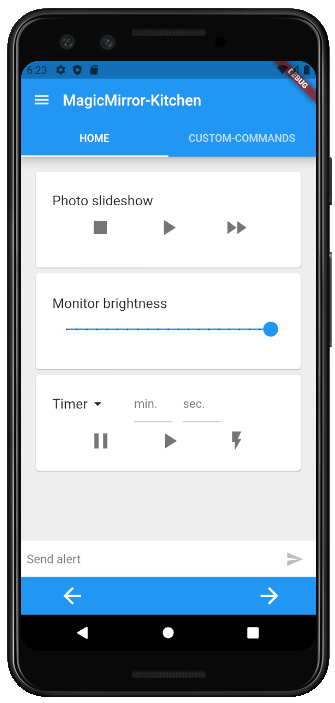

# MM-Remote 

  
MM-Remote is an Android 📱 and Windows 💻 app to control your [**MagicMirror**](https://magicmirror.builders/) remotely.  
  

  
## Features ##
  * Change the monitor brightness :high_brightness:    
  * Send alerts to the mirror  
  * Shutdown and reboot the mirror  
  * Turn the monitor on and off  
  * Play, stop and skip images :camera: of a photo-slideshow
  * Switch between UI-pages of the mirror
  * Create your own custom commands  
  * Start a timer on the mirror
  * Start a stop-watch :hourglass_flowing_sand: on the mirror

### v3.0.0 ###
  * Windows desktop :computer: support
  * Sync monitor brightness and status (on/of) with mirror
  * Switch between light and dark mode :first_quarter_moon_with_face:
  * Improved Stopwatch/Timer card
  * Improved settings page
  * Upgrade of Flutter and Android version
  
&nbsp;
## Dependencies ##
  
### Required :warning: (the app won't work without it): ###
| Module | Usage |
| ------ |------ |
| [MMM-Remote-Control](https://github.com/Jopyth/MMM-Remote-Control) (version 2.2.0 or higher)| Communication between app and mirror |
    
### Optional (without these, some default commands won't work): ###
If you do not use all the optional dependencies some default commands won't work, but such commands can be hidden in the settings.  

| Module | Usage |  
| ------ |------ |  
| [MMM-BackgroundSlideshow](https://github.com/darickc/MMM-BackgroundSlideshow) | Controlling a photo-slideshow on the mirror |  
| [MMM-Pages](https://github.com/edward-shen/MMM-pages) | Switching between different UI-pages |  
| [MMM-StopwatchTimer](https://github.com/klettner/MMM-StopwatchTimer) | Controlling a timer/stop-watch on the mirror |  
  
&nbsp;
## Installation guide ##
* For Android 📱 look [here](https://github.com/Klettner/MM-Remote/wiki/Installation-Android)
* For Windows 💻 look [here](https://github.com/Klettner/MM-Remote/wiki/Installation-Windows)

## Getting started ##
* Have a look at [wiki/Getting-started](https://github.com/Klettner/MM-Remote/wiki/Getting-started)
   
&nbsp;
## :bulb: Trouble shooting :bulb: ##  
 * If something is not working properly, have a look at [wiki/Trouble-shooting](https://github.com/Klettner/MM-Remote/wiki/Trouble-shooting) first. 
 * If it still can't be resolved, create an issue.

&nbsp;
## Final words :tada: ##
This is the first app I have created, therefore I would be happy about some feedback.  
If you have any feature requests, bugs or ideas for improvements please create an issue. 
If you want to contribute yourself, feel free to make a pull request.
